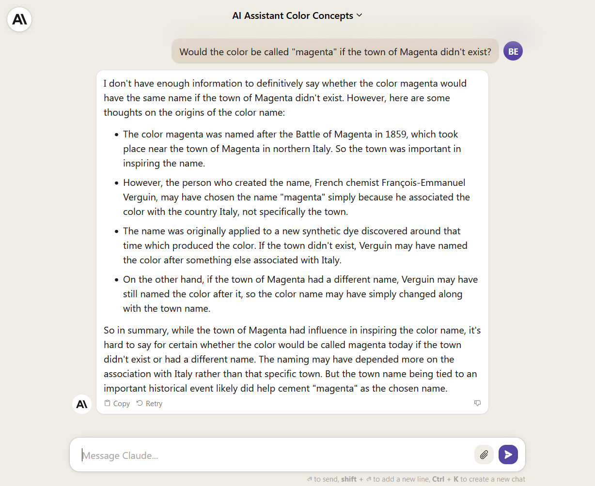
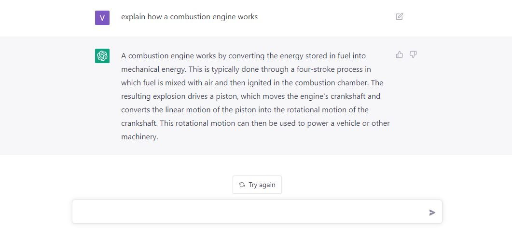
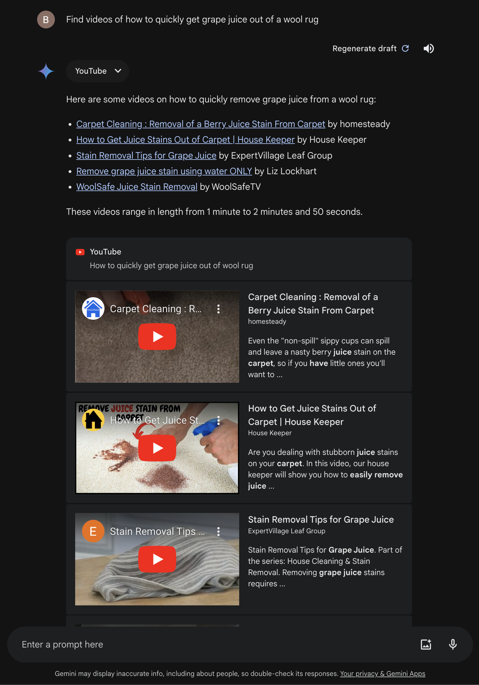
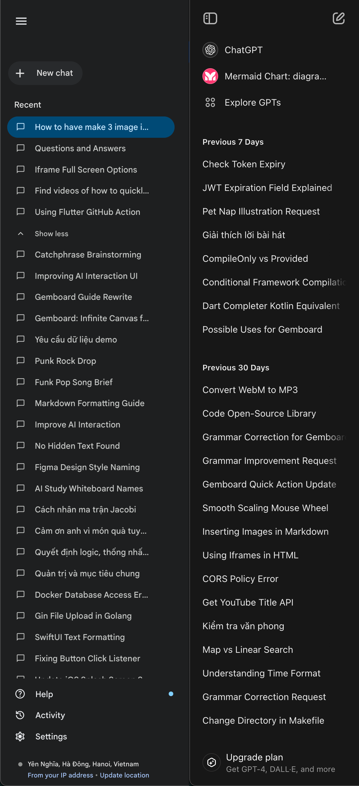

On May 14th, 2024, Google announced the Gemini API Developer Competition. Inspired by Gemini's impressive capabilities with its 1 million token context and outstanding output quality, I came up with Gemboard - a novel approach to interacting with chatbots.

## The Current UI Landscape

Let's first examine existing UI for human-LLM (Large Language Model) interaction:

This chatbot-style UI is useful for quick Q\&A and short tasks like asking simple questions or clarifying concepts. However, it falls short when it comes to synthesizing knowledge, connecting ideas, or discovering insights within the generated data. When revisiting past interactions, we're faced with interfaces like this:

Finding information within a sea of previous questions is cumbersome. This often leads to simply re-asking the question, further cluttering the chat history without guaranteeing a satisfactory answer.

This UI also presents other challenges:

- How to effectively reuse context from previous questions?
- How to visualize relationships between generated data points?
- And more...

Today's data is multi-dimensional. Deep dives into a topic require understanding the connections between subtopics and visualizing the bigger picture.

Gemboard is born from this need, envisioning an infinite canvas populated by data-containing "Cells" interconnected via "Edges."

##  A Glimpse at Gemboard

Inspired by applications like Figma and Notion, my initial design for Gemboard features a left sidebar for navigating boards and folders.

### The Core Idea

With the initial goal of capturing and connecting thoughts during AI interaction, I envisioned a traditional chatbot UI where each user query and AI response generates a "Cell." These "Cells" can contain text, files, images, videos, and more. You can then drag and drop these "Cells" outside the chat and into other conversations.

### Tool Types

Beyond the traditional "chatbox", I introduced the "promptbox" - a more structured data input method. "Promptbox" follows this structure:
- Input: List of images, text, files
- Output: Structured data such as images or JSON.

### Canvas "Cell" Types

Within each board, "Cells" come in three fundamental data types:
- Text
- Image
- Audio

Additionally, recognizing the difficulty of formulating the right questions during research, I incorporated a "Brainstorming" "Cell" type. Finding the right sequence of questions often leads to faster results.

Besides data-containing "Cells," connecting "Cells" through "Edges" is crucial. Imagine grouping and labeling "Cells" to further facilitate insight discovery.

## Conclusion

That's the origin story of Gemboard! From a spark of inspiration to improve AI interaction, Gemboard took shape, drawing inspiration from Figma and Notion's sleek interfaces.

Gemboard transcends simple chat, empowering you to arrange and connect ideas and data visually, almost like playing with Lego!

This is just the beginning for Gemboard. Many exciting developments lie ahead. Stay tuned for future updates and explore the potential of Gemboard! 😉 
