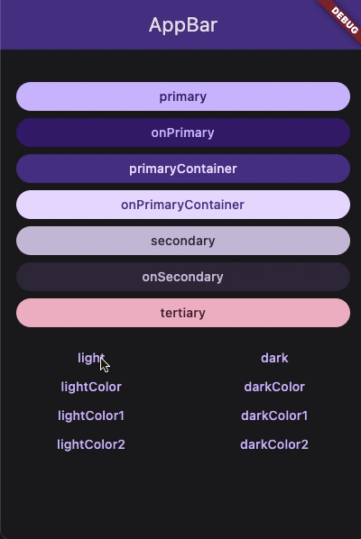

Theming in flutter is hard! Everyone have they owns implementation for their app. But in Flutter 3.16, we meet new `ThemeExtension` API that fit ours own need for customizing `Theme` object.

After this article, you will know how to create your own stylish, flashy style 🪄 and not be tied to the default `Material` anymore.

## What problem with `Theme` widget

`Theme` widget is very useful, it contains dozen of handful pre-built `Material` theme by Google like `colorScheme`, `textTheme`, `cardTheme`, ... And these default properties give us **lerping** feature for free!~ 



The problems when someone want to create slightly difference `textTheme` for example you came from the Web and want to have default `textStyle` preset like `h1`, `h2`, `h3`, `h4`, `h5`, `h6`, `p`. 

## Approach 1: Mapping equalvalent `textStyle` from `Material` textTheme

Now we need to create an `extension` for `Theme` like this:

```dart
extension WebTextTheme on Theme {
    TextStyle get h1 => textTheme.displayLarge;
    TextStyle get h2 => textTheme.displayMedium;
    TextStyle get h3 => textTheme.displaySmall;
    ...
    TextStyle get p => textTheme.bodyMedium;
}

class Foo extends StatelessWidget {
    Widget build(BuildContext context) {
        final theme = Theme.of(context);

        return Text(
            "Bar",
            style: theme.textTheme.p,
        );
    }
}
```

That nice! Elegant and simple. But this works on pre-define properties that fit with our convention, think very customizable like button this not gonna going well ... 

### Pros
- Easy implement
- Lerping for free~

### Cons
- Very cumbersome if you want deeply customize
- Depend on `Material` design specs

## Approach 2: Create custom `WebTextTheme` class

This is the hard-core one! Create a class and define all `h1`, ..., `h6`, `p` variants and create a static instance to access.

```dart
class WebTextTheme {
    const WebTextTheme({
        required this.h1,
        required this.h2,
        required this.h3,
        required this.h4,
        required this.h5,
        required this.h6,
        required this.p,
    });

    static final defaultWebTextTheme = WebTextTheme(
        h1: TextStyle(fontSize: 64),
        h2: TextStyle(fontSize: 58),
        h3: TextStyle(fontSize: 48),
        h4: TextStyle(fontSize: 36),
        h5: TextStyle(fontSize: 32),
        h6: TextStyle(fontSize: 28),
        p: TextStyle(fontSize: 16),
    );

    final TextStyle h1;
    final TextStyle h2;
    final TextStyle h3;
    final TextStyle h4;
    final TextStyle h5;
    final TextStyle h6;
    final TextStyle p;
}

class Foo extends StatelessWidget {
    Widget build(BuildContext context) {
        final webTextTheme = WebTextTheme.defaultWebTextTheme;

        return Text(
            "Bar",
            style: webTextTheme.p,
        );
    }
}
```

This looks very wrong! What if we have dark mode? How to lerping between light and dark when switching? If your app is never have 2 or more variants of `WebTextTheme` so it totally fine to use it. 

To be honest, this is simplest and fastest in term of performance. You just grab it and slap in to style 🫣 But in other hand, it have zero value of reusable, swappable.

### Pros
- Fast
- Customizable

### Cons
- Can't easily swapping
- No lerping (😢)

## Solution

So each appoarch have it own pros & cons to fix this problem. drumm rolll.... Introducing  ***ThemeExtension***. We need to implement 2 method `copyWith` and `lerp`.

```dart
abstract class ThemeExtension<T extends ThemeExtension<T>> {
  /// Enable const constructor for subclasses.
  const ThemeExtension();

  /// The extension's type.
  Object get type => T;

  /// Creates a copy of this theme extension with the given fields
  /// replaced by the non-null parameter values.
  ThemeExtension<T> copyWith();

  /// Linearly interpolate with another [ThemeExtension] object.
  ///
  /// {@macro dart.ui.shadow.lerp}
  ThemeExtension<T> lerp(covariant ThemeExtension<T>? other, double t);
}
```

### Manual

Create new `WebTextTheme` class extends `ThemeExtension`.
```dart
class WebTextTheme extends ThemeExtension<WebTextTheme> {
  const WebTextTheme({
    required this.h1,
    required this.h2,
    required this.h3,
    required this.h4,
    required this.h5,
    required this.h6,
    required this.p,
  });

  static final defaultTextTheme = () {
    const inter = TextStyle(fontFamily: 'Inter');
    return WebTextTheme(
      h1: inter.copyWith(
        fontSize: 72,
        height: 80 / 72,
        letterSpacing: -1,
        fontWeight: FontWeight.normal,
        overflow: TextOverflow.visible,
      ),
      h2: inter.copyWith(
        fontSize: 64,
        height: 72 / 64,
        letterSpacing: -0.8,
        fontWeight: FontWeight.normal,
        overflow: TextOverflow.visible,
      ),
      h3: inter.copyWith(
        fontSize: 48,
        height: 54 / 48,
        letterSpacing: -0.7,
        fontWeight: FontWeight.normal,
        overflow: TextOverflow.visible,
      ),
      h4: inter.copyWith(
        fontSize: 36,
        height: 42 / 36,
        letterSpacing: -0.6,
        fontWeight: FontWeight.normal,
        overflow: TextOverflow.visible,
      ),
      h5: inter.copyWith(
        fontSize: 30,
        height: 36 / 30,
        letterSpacing: -0.5,
        fontWeight: FontWeight.normal,
        overflow: TextOverflow.visible,
      ),
      h6: inter.copyWith(
        fontSize: 24,
        height: 32 / 24,
        letterSpacing: -0.4,
        fontWeight: FontWeight.normal,
        overflow: TextOverflow.visible,
      ),
      p: inter.copyWith(
        fontSize: 20,
        height: 28 / 20,
        letterSpacing: -0.2,
        fontWeight: FontWeight.normal,
        overflow: TextOverflow.visible,
      ),
    );
  }();

  final TextStyle h1;
  final TextStyle h2;
  final TextStyle h3;
  final TextStyle h4;
  final TextStyle h5;
  final TextStyle h6;
  final TextStyle p;
}
```

First implement `copyWith` method, this give us ability to custom individual parameter, without rewrite whole duplicate other parameters.

```dart
  // Under `final TextStyle p;`
  @override
  WebTextTheme copyWith({
    TextStyle? h1,
    TextStyle? h2,
    TextStyle? h3,
    TextStyle? h4,
    TextStyle? h5,
    TextStyle? h6,
    TextStyle? p,
  }) {
    return WebTextTheme(
      h1: h1 ?? this.h1,
      h2: h2 ?? this.h2,
      h3: h3 ?? this.h3,
      h4: h4 ?? this.h4,
      h5: h5 ?? this.h5,
      h6: h6 ?? this.h6,
      p: p ?? this.p,
    );
  }
```

The `lerp` method for transition between two state smoothly without chopping feel. It takes `other` parameter - the final state we lerping to, `t` the progress of lerping process.

In Flutter, `TextStyle` have it built-in `lerp` function.

```dart
  // Under `final TextStyle p;`
  @override
  WebTextTheme lerp(
      covariant ThemeExtension<WebTextTheme>? other, double t) {
    if (other is! WebTextTheme) return this as WebTextTheme;
    return WebTextTheme(
      h1: TextStyle.lerp(h1, other.h1, t)!,
      h2: TextStyle.lerp(h2, other.h2, t)!,
      h3: TextStyle.lerp(h3, other.h3, t)!,
      h4: TextStyle.lerp(h4, other.h4, t)!,
      h5: TextStyle.lerp(h5, other.h5, t)!,
      h6: TextStyle.lerp(h6, other.h6, t)!,
      p: TextStyle.lerp(p, other.p, t)!,
    );
  }
```

After setting up the `WebTextTheme` theme extension, we need to register it to `Theme`. Something look like this.

```dart
    MaterialApp(
        theme:  ThemeData(
            extensions: [
                WebTextTheme.defaultWebTextTheme,
           ],
        ),
    )
```

And accessing it with `Theme` widget by `extension` method and expect an `WebTextTheme`. It can be null so if you sure that cannot null, put a `!` to enforce it to non-null.

```dart
Widget build(BuildContext context) {
    final theme = Theme.of(context);
    final webTextTheme = theme.extension<WebTextTheme>()!;

    ...
}
```

Phew! It look clean now! But we need to write 100 lines of code. And most of it is just boilerplate code, so it's a right time to put a code generator to do it for our. 

### Code-gen

We have a very nice and robust library [theme_tailor](https://pub.dev/packages/theme_tailor) - a code generator and theming utility for supercharging Flutter ThemeExtension classes introduced in Flutter 3.0! The generator helps to minimize the required boilerplate code.

#### Install

```
flutter pub add --dev build_runner
flutter pub add --dev theme_tailor
flutter pub add theme_tailor_annotation
```

#### Usage

Put `tailorMixin` annotation in top of `WebTextTheme` theme extension. and mixed with `_$WebTextThemeTailorMixin` mixin which generated by `theme_tailor`.

After that, don't forget to put `web_text_theme.tailor.dart` generated file with this line `part 'web_text_theme.tailor.dart;`

```dart
part 'web_text_theme.tailor.dart';

@tailorMixin
class WebTextTheme extends ThemeExtension<WebTextTheme> with _$WebTextThemeTailorMixin {
  const WebTextTheme({
    required this.h1,
    required this.h2,
    required this.h3,
    required this.h4,
    required this.h5,
    required this.h6,
    required this.p,
  });

  static WebTextTheme defaultWebTextTheme = ...;

  @override
  final TextStyle h1;
  @override
  final TextStyle h2;
  @override
  final TextStyle h3;
  @override
  final TextStyle h4;
  @override
  final TextStyle h5;
  @override
  final TextStyle h6;
  @override
  final TextStyle p;
}
```

We reduce to just 27 line of code to get your own custom theme with buttery-smooth 🤌 fast 💨 extensible 🧩