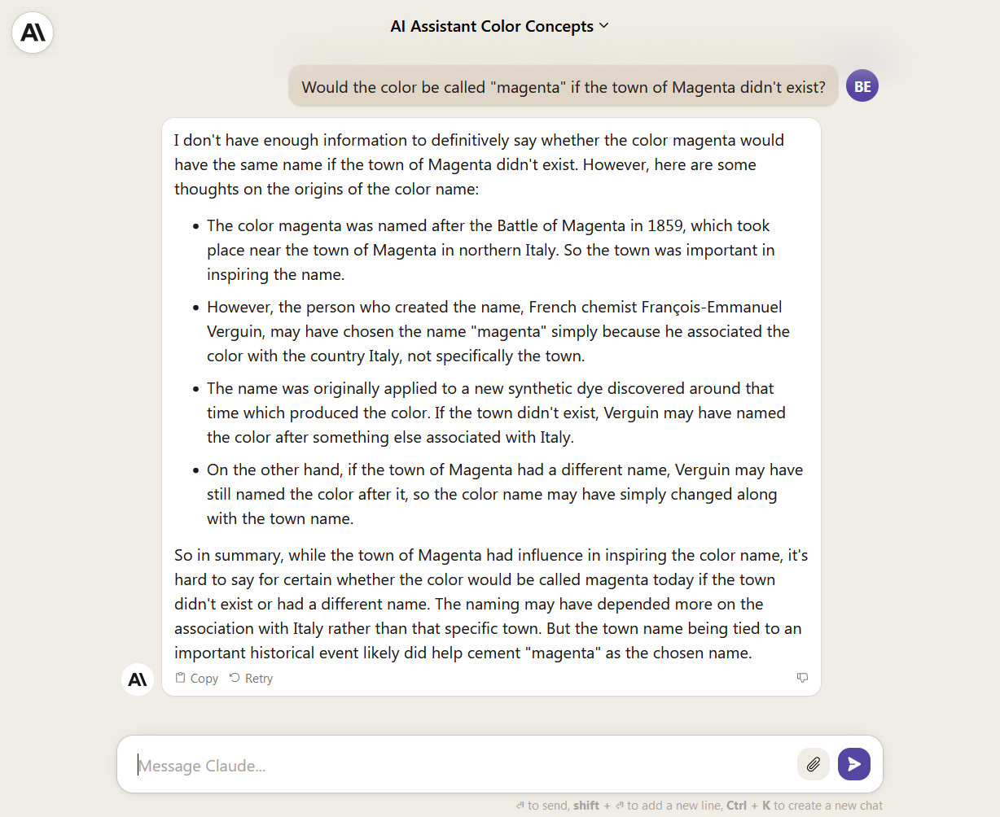
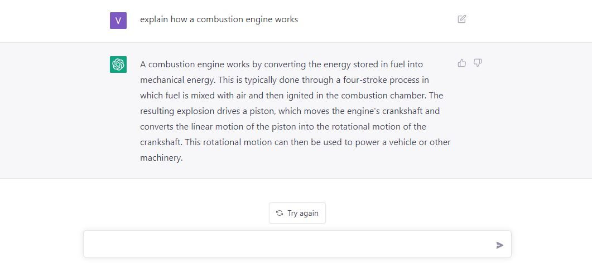
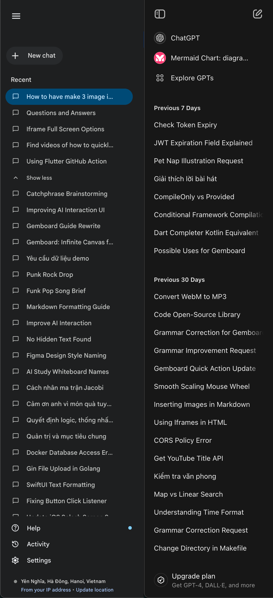

Vào ngày 14 tháng 5 năm 2024, Google đã thông báo bắt đầu cuộc thi Gemini API Developer Competition.
Khi nhìn thấy khả năng của Gemini với context 1 triệu token và kết quả trả ra rất ấn tượng.
Việc này đã khiến tôi nảy ra Gemboard, một phương thức mới để tương tác với chat bot.

## Tình trạng UI hiện tại

Đầu tiên cần nhìn lại những UI của việc tương tác giữa người và LLM (Large language model) như sau:

UI dạng chatbot này thực sự rất hữu ích cho việc hỏi đáp nhanh và các tác vụ ngắn hạn như hỏi bài tập, hỏi về ý nghĩa của một chủ đề nhỏ nào đó. Nhưng nó lại không phù hợp cho việc tổng hợp kiến thức hay kết nối và truy tìm các insight ở trong chính dạng dữ liệu mà AI trả ra. Kết quả là khi ta truy vấn lại những gì mà mình đã hỏi với AI chúng ta phải nhìn những giao diện như này.

Chi phí của việc tìm lại dữ liệu trong một rừng các câu hỏi trước đó như bên trên rất lớn đến mức mà hành động tiếp theo của chúng là sẽ là hỏi lại câu hỏi đó một lần nữa và khiến cho lịch sử chat của chúng ta dài hơn nữa và chưa chắc những câu trả lời của AI đã làm bạn hài lòng như lần trước đó.

Ngoài ra còn rất nhiều các vấn đề như:
- Làm cách nào để sử dụng lại context của các câu hỏi trước đó?
- Làm cách nào để biểu đạt tương quan giữa các dữ liệu mà chúng ta đã tạo sinh ra?
- ...

Ngày nay dữ liệu không chỉ là dữ liệu một chiều, khi nghiên cứu sâu một vấn đề cần thể hiện được sự liên kết giữa các chủ đề nhỏ trong vấn đề và nhìn được bức tranh toàn cảnh.

Gemboard được lấy cảm hứng từ góc nhìn trên, từ đó tôi đã hình thành ý tưởng về một infinity canvas trong đó có các "Cell" chứa dữ liệu và các "Edge" để liên kết các dữ liệu đó với nhau.

## Bản mẫu

Tôi đã lên bản vẽ đầu tiên cho giao diện của Gemboard, nó sẽ lấy cảm hứng từ các ứng dụng như Figma và Notion. Với thanh sidebar bên tay trái là nơi chứa các board, và folder cho board. 

### Linh hồn của ý tưởng

Với mục tiêu ban đầu là lưu giữ và kết nối các dòng suy nghĩ khi tương tác với AI. Ý tưởng đầu tiên loé lên trong đầu tôi là một dạng UI chatbot truyền thống với mỗi lần chúng ta đặt câu hỏi hay AI trả lời sẽ được trả về như mỗi `Cell`. Mỗi `Cell` này có thể là text, file, hay hình ảnh, video, ... Điều đặc biệt là bạn có thể kéo nó ra ngoài đoạn chat và đưa `Cell` đó sang một đoạn hội thoại khác. 

### Loại công cụ

Ngoài `chatbox` truyền thống, tôi có tạo thêm một loại box nữa là `promptbox`. Về cơ bản `promptbox` sẽ thuộc dạng dữ liệu "có cấu trúc" hơn là `chatbox` - một cuộc hội thoại đơn thuần. `promptbox` có cấu trúc dạng:
- Đầu vào: Danh sách ảnh, text, file
- Đầu ra: dữ liệu có cấu trúc như ảnh hoặc `json` 

### Loại `Cell` trong canvas

Hãy nghĩ thêm về `Cell` trong mỗi bảng của chúng ta. Đương nhiên chúng sẽ có 3 loại dữ liệu cơ bản:
- `Text`
- `Ảnh`
- `Âm thanh`

và ngoài ra tôi nhận thấy rằng khi tôi nghiên cứu một vấn đề, tôi thực sự gặp khó khăn cho việc đặt một câu hỏi đúng! Khi tìm được một chuỗi câu hỏi đúng thường sẽ dẫn tôi đến kết quả nhanh hơn. `Brainstorming` chính là loại `Cell` mà tôi đặc biệt thêm vào để giải quyết vấn đề này.

Ngoài các `Cell` có dữ liệu, tôi cũng cần tạo ra các loại `Cell` có tác dụng kết nối các `Cell` với nhau. Có thể gọi nó là các cạnh (`Edge`). 

Một vài tính năng khá hữu ích nếu có như nhóm các `Cell` lại và dán nhãn chúng cũng sẽ giúp tăng khả năng tìm ra insight cho vấn đề dễ dàng hơn.

## Tổng kết

Phù! Vậy là chúng ta đã cùng nhau đi qua hành trình khai sinh ra Gemboard rồi! Từ một ý tưởng lóe sáng về việc cải thiện cách tương tác với AI, Gemboard đã dần thành hình với giao diện "xịn xò" lấy cảm hứng từ Figma và Notion.
Bạn thấy đấy, không chỉ dừng lại ở việc chat đơn thuần, Gemboard còn cho phép bạn tự do sắp xếp, kết nối các ý tưởng, dữ liệu một cách trực quan và sinh động như đang chơi Lego vậy!
Tất nhiên, đây mới chỉ là những bước chập chững đầu tiên của Gemboard. Còn rất nhiều điều thú vị đang chờ đón chúng ta ở phía trước. Hãy cùng theo dõi những cập nhật tiếp tiếp theo để khám phá thêm về Gemboard nhé! 😉