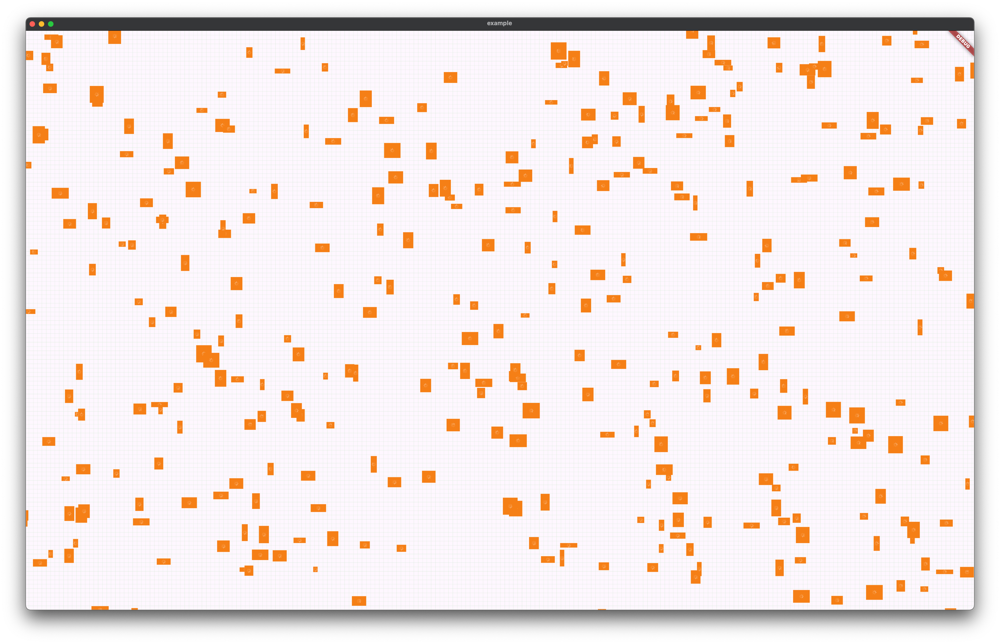

Vào ngày 14 tháng 5 năm 2024, Google đã thông báo bắt đầu cuộc thi Gemini API Developer Competition.
Khi nhìn thấy khả năng của Gemini với context 1 triệu token và kết quả trả ra rất ấn tượng.
Việc này đã khiến tôi nảy ra Gemboard, một phương thức mới để tương tác với chat bot.

## Tình trạng UI hiện tại

Đầu tiên cần nhìn lại những UI của việc tương tác giữa người và LLM (Large language model) như sau:

UI dạng chatbot này thực sự rất hữu ích cho việc hỏi đáp nhanh và các tác vụ ngắn hạn như hỏi bài tập, hỏi về ý nghĩa của một chủ đề nhỏ nào đó. Nhưng nó lại không phù hợp cho việc tổng hợp kiến thức hay kết nối và truy tìm các insight ở trong chính dạng dữ liệu mà AI trả ra. Kết quả là khi ta truy vấn lại những gì mà mình đã hỏi với AI chúng ta phải nhìn những giao diện như này.

Chi phí của việc tìm lại dữ liệu trong một rừng các câu hỏi trước đó như bên trên rất lớn đến mức mà hành động tiếp theo của chúng là sẽ là hỏi lại câu hỏi đó một lần nữa và khiến cho lịch sử chat của chúng ta dài hơn nữa và chưa chắc những câu trả lời của AI đã làm bạn hài lòng như lần trước đó.

Ngoài ra còn rất nhiều các vấn đề như:
- Làm cách nào để sử dụng lại context của các câu hỏi trước đó?
- Làm cách nào để biểu đạt tương quan giữa các dữ liệu mà chúng ta đã tạo sinh ra?
- ...

Ngày nay dữ liệu không chỉ là dữ liệu một chiều, khi nghiên cứu sâu một vấn đề cần thể hiện được sự liên kết giữa các chủ đề nhỏ trong vấn đề và nhìn được bức tranh toàn cảnh.

Gemboard được lấy cảm hứng từ góc nhìn trên, từ đó tôi đã hình thành ý tưởng về một infinity canvas trong đó có các "Cell" chứa dữ liệu và các "Edge" để liên kết các dữ liệu đó với nhau.

## Bản mẫu

Tôi đã lên bản vẽ đầu tiên cho giao diện của Gemboard, nó sẽ lấy cảm hứng từ các ứng dụng như Figma và Notion. Với thanh sidebar bên tay trái là nơi chứa các board, và folder cho board. 

TODO: Insert ảnh vẽ bản mẫu
TODO: Insert phân chia các loại cell

### Infinity canvas

Tôi sử dụng Flutter cho dự án này, trước đó tôi đã từng làm qua những UI như `Stack` kết hợp với `InteractiveViewer` và các UI dạng cuộn 2 chiều như dạng bảng tính. Tuy nhiên các loại UI này đều có nhược điểm là toạ độ của các thành phần trong view phải > 0.

Lấy ví dụ:
- Widget A ở toạ độ (độ, 20) thì khi đó ta mới có thể thực hiện các gesture trong widget đó.
- Nếu Widget B ở toạ độ (-10, -30) Khi dùng `Stack` kết hợp với `InteractiveViewer` phần hiển thị của widget đó vẫn được hiển thị lên tuy nhiên nó không thể thực hiện các gesture (onTap, onLongPressed, etc..) được do thuật toán tìm `hitTest` của flutter chỉ hoạt động trong vùng hiển thị của Widget cha.

Rất may mắn, Flutter 3.20 đã có một cải tiến rất lớn cho việc này! Đó chính là API `TwoDimensionalScrollView` và cảm ơn Flutter team đã có một video giới thiệu cách sử dụng không thể nào dễ hiểu hơn, bạn có thể xem nó tại [đây](https://www.youtube.com/watch?v=ppEdTo-VGcg).

Tôi bắt đầu tạo ra package [boundless_stack](https://github.com/definev/boundless_stack) và open-source nó tại đây. bạn có thể tìm hiểu cách sử dụng nó sâu hơn trong repository này. Sau khi tạo ra package này tôi đã thử chạy với 10000 widget con bên trong và hoàn toàn có thể zoom, pan, và scroll hoàn toàn mượt mà!

